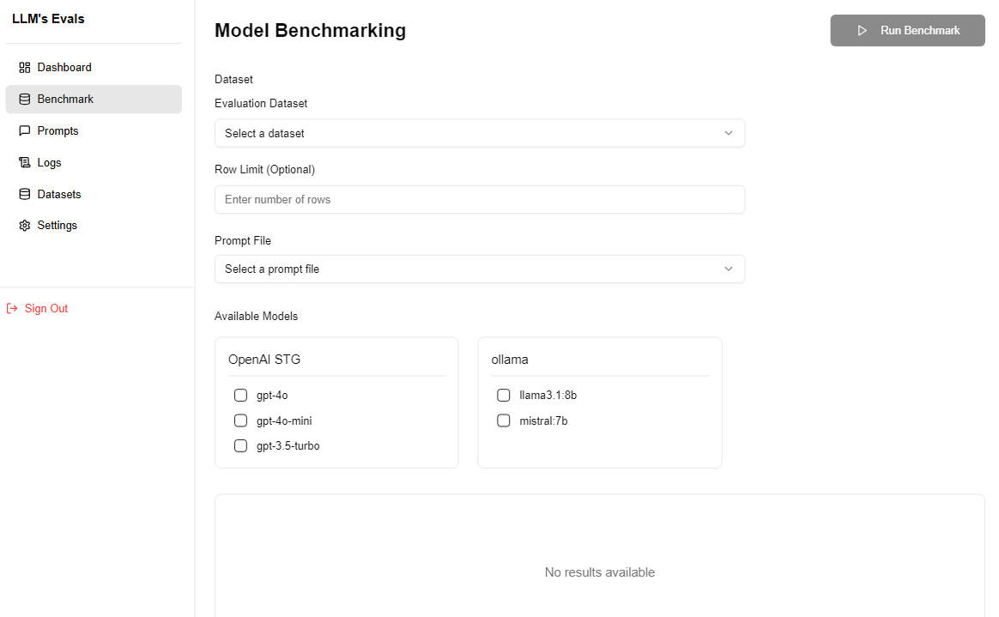
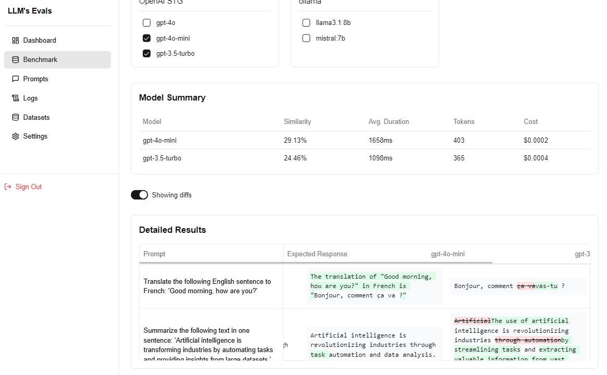
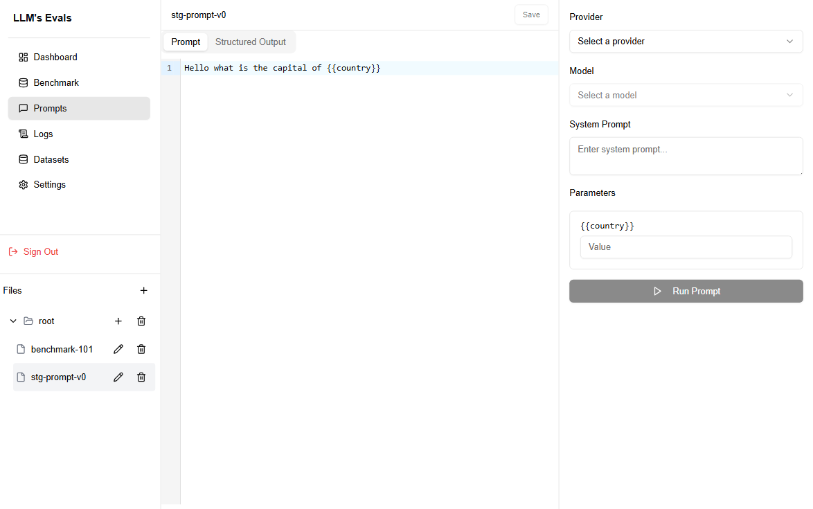
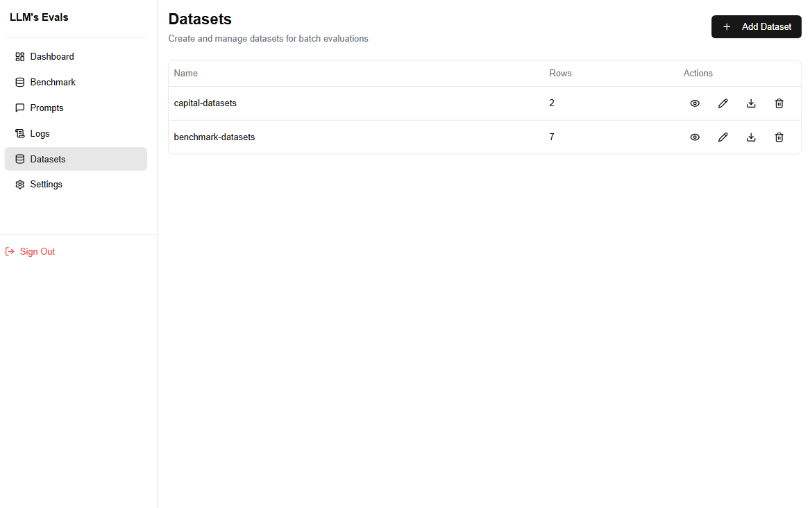

# LLM-Evals

A comprehensive LLM evaluation and comparison platform built with Next.js, designed to help organizations make informed decisions about their AI model deployments.


## Overview

LLM-Evals is a standard environment for evaluating and comparing different language models. The platform enables users to:

- Select and test various language models (GPT-4, GPT-3.5, LLaMA, DeepSeekV3, etc.)
- Input functional prompts and analyze responses across different models
- Compare key metrics including output quality, cost, and performance
- Make data-driven decisions for production deployments

This tool is particularly valuable for:

- Evaluating cost-effectiveness of different models for specific use cases
- Optimizing model selection for production environments
- Supporting informed decision-making for budget allocation and resource planning

## Table of Contents

- [Key Features](#key-features)
- [Demo](#demo)
- [Quick Start](#quick-start)
- [Documentation](#documentation)
- [Development](#development)
- [Contributing](#contributing)
- [License](#license)

## Key Features

- **Next.js 14 Architecture**: Built on the latest Next.js framework for optimal performance and SEO
- **Enterprise Security**: Industry-standard authentication and data protection
- **Responsive Design**: Seamless experience across all devices and screen sizes
- **API Integration**: Ready-made connectors for popular LLM providers
- **Production Ready**: Built with scalability and maintainability in mind
- **Developer Experience**: Comprehensive documentation and easy-to-extend codebase

## Demo

### Live Platform

[Access the platform](https://your-production-url.com)

### Product Screenshots

<details> 
<summary>View Screenshots</summary>

#### Benchmark





#### Playground



#### Datasets



</details>

### Product Demo

[Watch the demo video](your-video-link)

## Quick Start

### System Requirements

- Node.js 18.0 or later
- npm 8.0+ or yarn 1.22+
- A supported LLM API key

### Installation

1. Clone the repository

```bash
git clone https://github.com/yourusername/llm-Evals.git
cd llm-Evals
```

2. Install dependencies

```bash
npm install
```

3. Configure environment

```bash
cp .env.example .env.local
```

Configure your `.env.local` with required API keys and settings

4. Launch development environment

```bash
npm run dev
```

Access the development server at [http://localhost:3000](http://localhost:3000)

## Documentation

### API Reference

[Link to detailed API documentation]

## Development

### Project Structure

```
src/
├── app/          # Next.js app directory
├── components/   # Reusable React components
├── lib/          # Utility functions and helpers
├── api/          # API routes and handlers
└── types/        # TypeScript type definitions
```

### Testing

```bash
# Run unit tests
npm run test

# Run integration tests
npm run test:integration

# Run e2e tests
npm run test:e2e
```

## Contributing

We welcome contributions from the community. Please read our [Contributing Guidelines](CONTRIBUTING.md) before submitting a pull request.

### Development Process

1. Fork the repository
2. Create a feature branch (`git checkout -b feature/YourFeature`)
3. Commit changes (`git commit -m 'Add YourFeature'`)
4. Push to your branch (`git push origin feature/YourFeature`)
5. Open a Pull Request

## License

This project is licensed under the [MIT License](LICENSE).

---

<p align="center">Built by lost-code| <a href="https://lost-code.dev">Website</a> | <a href="https://twitter.com/lost-code">Twitter</a></p>
